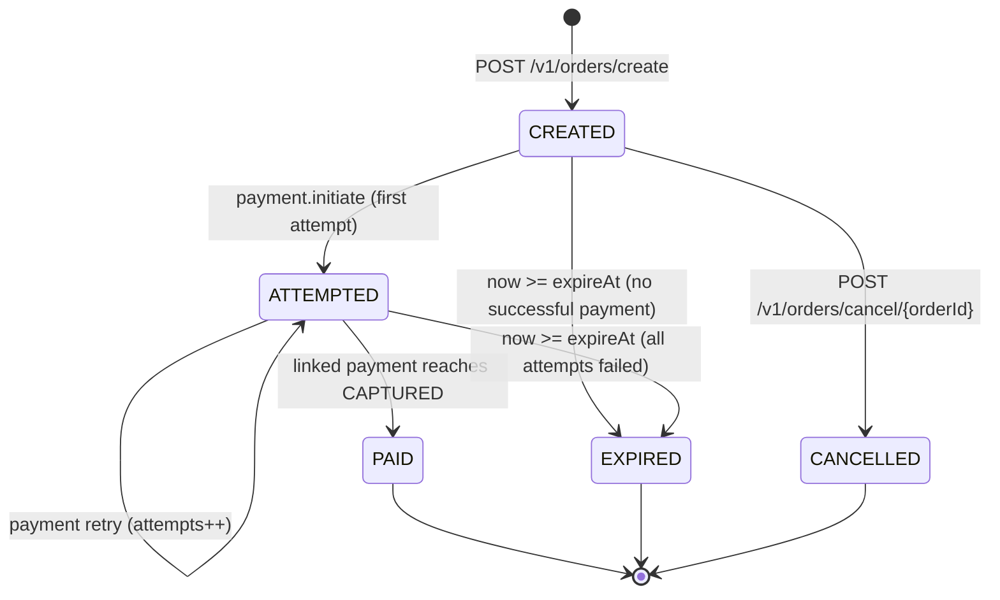
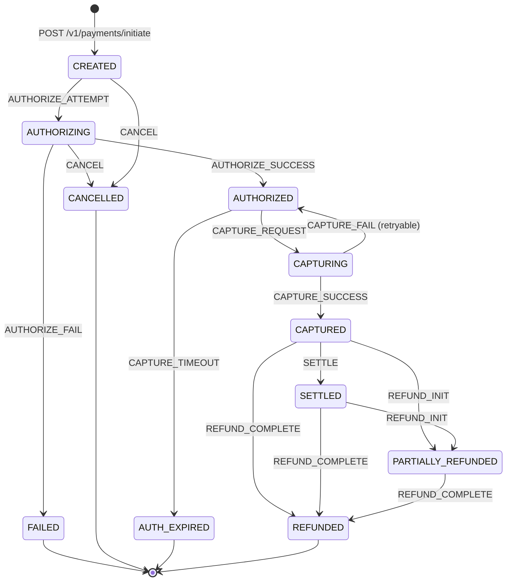
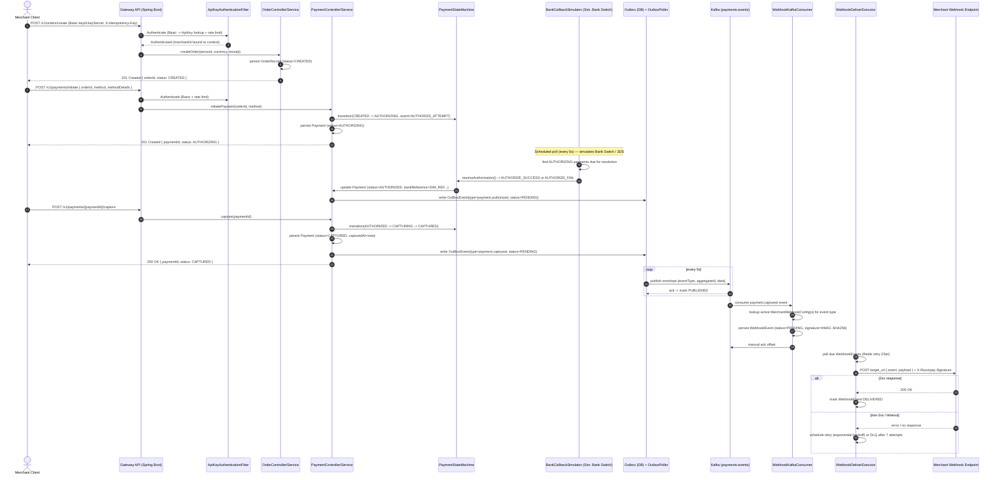
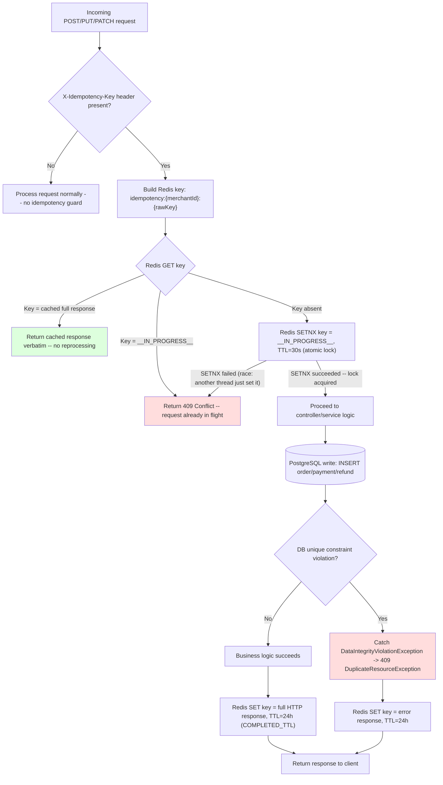
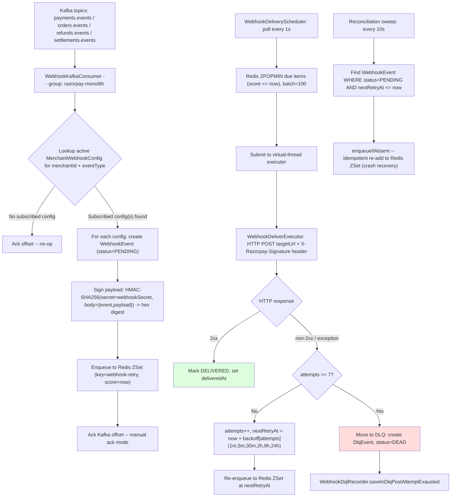
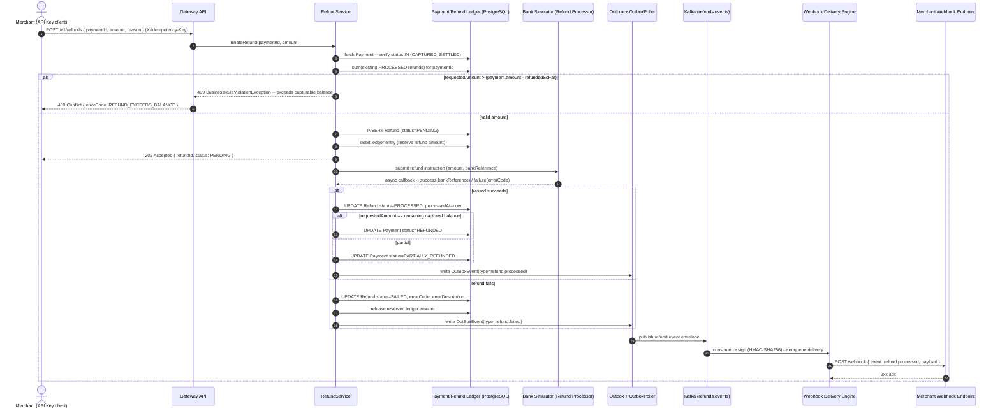
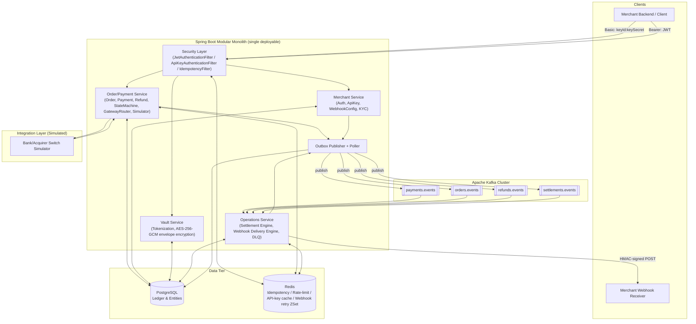
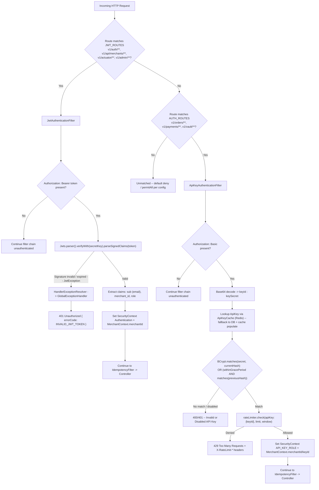

# razorpayClone — Functional Specification & Technical Design Document

**Document Owner:** Preetam Singh
**System:** razorpayClone — Payment Gateway Backend (Modular Monolith)
**Stack:** Java 25 / Spring Boot 4 (Spring Security, Spring Data JPA/Hibernate, Spring Kafka, Spring Data Redis) / PostgreSQL / Redis / Apache Kafka
**Scope:** This document is derived directly from the current codebase (`com.preesa.razorpay`) — entity fields, enum values, endpoints, and operational parameters reflect the real implementation, not idealized assumptions.

---

## Table of Contents

1. [Section 1 — Functional Specification Document (FSD)](#section-1--functional-specification-document-fsd)
2. [Section 2 — Critical Architecture & Flow Diagrams](#section-2--critical-architecture--flow-diagrams)
3. [Section 3 — Technical Design Document (TDD)](#section-3--technical-design-document-tdd)

---

## SECTION 1: Functional Specification Document (FSD)

### 1.1 System Actors

| Actor | Description | Interaction Surface |
|---|---|---|
| **Merchant (Business)** | Registered entity accepting payments. Owns API credentials, webhook config, settlement bank account. | `/v1/auth/**`, `/v1/api/merchants/**` (JWT-secured) |
| **Merchant Team User** | Human users of a merchant account with roles `OWNER`, `ADMIN`, `TEAM` (`UserRole` enum). Authenticates via email/password → JWT. | `/v1/auth/login`, `/v1/auth/signup` |
| **End Customer** | The payer. Identified optionally via `Customer` entity (name, email, contact) linked to a merchant. Not a direct API actor — initiates payment data (card/UPI/netbanking) through the merchant's checkout, which relays to the gateway. | Indirect — via `PaymentInitRequest.methodDetails` |
| **Server-to-Server Integration (API Key Caller)** | The merchant's backend server, authenticated via `Key ID` + `Key Secret` (HTTP Basic). Used for all transactional order/payment/refund/vault calls. | `/v1/orders/**`, `/v1/payments/**`, `/v1/vault/**` |
| **Acquiring Partner / Bank Switch (Simulated)** | Simulated bank/processor that asynchronously authorizes or declines payments. Implemented as a scheduled background poller (`BankCallbackSimulator`) rather than a live external bank in this environment. | Internal scheduled job, mutates `Payment` status |
| **Admin / Ops Portal** | Operational surface reserved under `/v1/admin/**` (JWT-protected route group) for internal staff — settlement oversight, DLQ review, merchant status management. | `/v1/admin/**` |
| **Webhook Receiver (Merchant Endpoint)** | The merchant's own HTTPS endpoint that receives signed event callbacks (`payment.authorized`, `payment.captured`, etc.). | Outbound HTTP POST from `WebhookDeliverExecutor` |

### 1.2 Core Functional Modules

#### 1.2.1 Merchant Management

- **Registration (`POST /v1/auth/signup`)**: Creates a `Merchant` (business profile: name, email, business name, business type) and an owning `AppUser` (role `OWNER`). Merchant starts in `MerchantStatus.PENDING_KYC`.
- **Business Profile & KYC**: `Merchant` entity carries `gstId`, `panId`, `businessType` (`LLP`, `PROPRIETORSHIP`, `PARTNERSHIP`, `PRIVATE_LIMITED`, `PUBLIC_LIMITED`, `TRUST`), and settlement bank details (`settlementBankAccount`, `settlementBankIFSC`, `settlementBankAccountHolderName`). KYC verification transitions `MerchantStatus`: `PENDING_KYC → ACTIVE` (verified) or `→ SUSPENDED` (risk/compliance action).
- **Login (`POST /v1/auth/login`)**: Validates email/password (BCrypt) against `AppUser`, issues a JWT (`LoginResponse.accessToken`) containing `sub=email`, `merchant_id`, `role`, 24-hour expiry.
- **API Credentials (`/v1/api/merchants/api-keys`)**:
  - **Create** (`POST /create`): Generates `keyId` (public) + `keySecret` (shown once, BCrypt-hashed as `keySecretHash` before storage) scoped to an `Environment` (`DEV`, `UAT`, `PRODUCTION`).
  - **List** (`GET /getAllApiKey`): Returns non-secret metadata only.
  - **Revoke** (`DELETE /revoke/{keyId}`): Disables the key (`enabled=false`).
  - **Rotate** (`POST /rotate/{keyId}`): Issues a new secret while preserving the old hash in `previousKeySecretHash` for a **grace period** (`gracePeriodExpiresAt`), allowing zero-downtime credential rotation.
- **Webhook Configuration (`/v1/api/merchants/webhooks`)**: CRUD for `MerchantWebhookConfig` — target URL, per-merchant `webhookSecret` (HMAC signing key), and `eventTypes` subscription filter (comma-separated, or `ALL`).

#### 1.2.2 Order Management

- `POST /v1/orders/create` creates an **immutable** `OrderRecord`:
  - `amount` (`Money` value object: `amountUnits` as `Long` in the lowest currency unit e.g. paise, + `currency` code).
  - `receipt` (merchant-supplied reconciliation ID, max 200 chars).
  - `notes` (arbitrary JSONB metadata map).
  - `expireAt` (TTL — orders not paid by this instant are eligible for expiry).
  - Optional inline `customer` (name/email/phone) — resolves/creates a `Customer` row.
  - Starts in `OrderStatus.CREATED`.
- Orders are **never mutated** on amount/currency/receipt after creation — only `orderStatus` and `attempts` (number of payment attempts linked to the order) change over the order's lifecycle.
- `GET /v1/orders/get/{orderId}` — fetch order.
- `POST /v1/orders/cancel/{orderId}` — explicit cancellation → `OrderStatus.CANCELLED` (only valid pre-payment).
- `GET /v1/orders/getpayments/{orderId}` — list all payment attempts against an order (supports retried/multiple-attempt flows).

#### 1.2.3 Payment Processing Engine

- **Multi-instrument support** via `PaymentMethod` enum: `CARD`, `NETBANKING`, `UPI`, `WALLET`, routed by `PaymentGatewayRouter` to method-specific adapters (`CardPaymentAdapter`, `NetBankingPaymentAdapter`, `UpiPaymentAdapter`).
- **Two-step flow — Authorization vs. Capture**:
  1. `POST /v1/payments/initiate` creates a `Payment` row (status `CREATED` → `AUTHORIZING`) and dispatches to the simulated bank switch asynchronously.
  2. The `BankCallbackSimulator` (scheduled poller, default every 5s) resolves the authorization outcome based on configured per-method delay windows and success rates — moving the payment to `AUTHORIZED` or `FAILED`.
  3. `POST /v1/payments/{paymentId}/capture` transitions `AUTHORIZED → CAPTURING → CAPTURED` (funds are only settled to the merchant once captured).
- **Status model** (`PaymentStatus`): `CREATED`, `AUTHORIZING`, `AUTHORIZED`, `CAPTURING`, `CAPTURED`, `FAILED`, `CANCELLED`, `REFUNDED`, `PARTIALLY_REFUNDED`, `SETTLED`, `AUTH_EXPIRED` — a strict superset of the simplified `CREATED → PENDING → AUTHORIZED → CAPTURED/FAILED` model, adding explicit `CAPTURING` (in-flight capture), `AUTH_EXPIRED` (authorized but not captured within window), settlement and refund terminal/semi-terminal states.
- Every transition is durably logged in `PaymentTransitionLog` (`fromStatus`, `toStatus`, `actor` — `MERCHANT`/`CUSTOMER`/`SYSTEM`, `event` — a `PaymentEvent` enum value, `occurredAt`) — giving a full forensic/audit trail per payment.
- Card payments never carry a raw PAN — the merchant passes a **vault token** (`methodDetails: {"token": "<vault-token>"}`) obtained from `POST /v1/vault/tokenizer`.

#### 1.2.4 Webhook & Notification Engine

- Event-driven, **Kafka-sourced**, at-least-once delivery.
- Canonical event types produced from domain state changes and published via the **Outbox pattern**: `payment.authorized`, `payment.captured`, `payment.failed`, `refund.processed` (and order/settlement equivalents).
- `WebhookKafkaConsumer` consumes `payments.events`, `orders.events`, `refunds.events`, `settlements.events`, resolves each merchant's **active subscribed** `MerchantWebhookConfig`(s) for the event type, and creates a `WebhookEvent` row (status `PENDING`) per (merchant, config, event).
- Delivery is signed with **HMAC-SHA256** using the merchant's `webhookSecret`, sent in the `X-Razorpay-Signature` header.
- **Retry policy**: exponential backoff schedule `[1m, 5m, 30m, 2h, 8h, 24h]` across up to **7 attempts**; after exhaustion the event is moved to the **Dead Letter Queue** (`DlqEvent`, `WebhookEventStatus.DEAD`).
- A reconciliation sweep (every 10s) re-enqueues any `PENDING` webhook whose `nextRetryAt` has silently lapsed (crash-recovery safety net), using an idempotent "enqueue-if-absent" ZSet operation.

#### 1.2.5 Refunds & Settlements

- **Refunds**: Triggered against a `CAPTURED` (or `SETTLED`) `Payment`. A `Refund` row (status `PENDING → PROCESSING → PROCESSED/FAILED`) is validated against the payment's remaining capturable balance — supports both **partial** (amount < captured amount, payment → `PARTIALLY_REFUNDED`) and **full** (amount == remaining balance, payment → `REFUNDED`) refunds. Multiple partial refunds are permitted until the captured amount is exhausted.
- **Settlements**: `SettlementEngine` runs daily (`cron 0 0 23 * * *`, 23:00 UTC) per merchant, aggregating all unsettled `CAPTURED` payments into a `Settlement`:
  - `grossAmount` = sum of captured amounts.
  - `feeAmount` = `grossAmount × 2%` (platform fee).
  - `gstAmount` = `feeAmount × 18%` (tax on fee, India GST).
  - `netAmount` = `grossAmount − feeAmount − gstAmount` → transferred to the merchant's settlement bank account.
  - Cross-referenced to constituent payments via `SettlementPayment` (composite key: `settlementId` + `paymentId`).
  - Status lifecycle: `INITIATED → TRANSFER_PENDING → PROCESSED` / `FAILED`.

### 1.3 State Transition Matrices

#### 1.3.1 Order State Lifecycle



> Note: the implemented `OrderStatus` enum is `CREATED, ATTEMPTED, PAID, CANCELLED`. `EXPIRED` is specified here as the functional requirement for TTL enforcement; see [§4 Edge Cases](#14-edge-cases--resilience-rules) for the recommended implementation note — it is currently handled operationally via `expireAt` comparison rather than a persisted terminal enum value, and should be promoted to an explicit status for correctness (see TDD §3.2 recommendation).

#### 1.3.2 Payment State Lifecycle



Each arrow above corresponds 1:1 to a `PaymentEvent` enum constant (`AUTHORIZE_ATTEMPT`, `AUTHORIZE_SUCCESS`, `AUTHORIZE_FAIL`, `CAPTURE_REQUEST`, `CAPTURE_SUCCESS`, `CAPTURE_FAIL`, `REFUND_INIT`, `REFUND_COMPLETE`, `SETTLE`, `CANCEL`, `CAPTURE_TIMEOUT`) and is persisted as a `PaymentTransitionLog` row.

### 1.4 Edge Cases & Resilience Rules

| Scenario | Risk | Mitigation (as implemented / recommended) |
|---|---|---|
| **Double-debit / duplicate charge** | Customer double-clicks "Pay" or merchant retries a timed-out request, causing two `Payment` rows for one intent. | `X-Idempotency-Key` header enforced by `IdempotencyFilter`: a Redis key `idempotency:{merchantId}:{rawKey}` with an `__IN_PROGRESS__` marker (30s TTL) blocks concurrent duplicate submissions; the completed response is cached for 24h and replayed verbatim on retry. Combined with a DB-level **unique constraint recommendation** on `(order_id, idempotency_key)` for `payments` as a second line of defense if Redis is unavailable (filter fails open on Redis errors — see below). |
| **Idempotency store unavailable (Redis down)** | Filter fails open (logs warning, allows request through) — duplicate risk increases while Redis is down. | Must be paired with a DB unique constraint on the idempotency key column so the second insert fails fast with a `DuplicateResourceException` (409) instead of creating a duplicate payment. |
| **Late / out-of-order bank callback** | `BankCallbackSimulator` resolves a payment after the merchant has already timed out and shown the customer a failure, or after the order's `expireAt` has passed. | State machine enforces valid-transition-only mutation (`AUTHORIZING → AUTHORIZED/FAILED` only); an authorization arriving after `AUTH_EXPIRED` triggers a **compensating refund** (auto-refund) rather than a silent capture, since the merchant has already been told the attempt failed. |
| **Network timeout on client-gateway call** | Client never receives the response although the order/payment was created server-side. | Client should retry **with the same `X-Idempotency-Key`**; server returns the cached prior result rather than creating a new resource. All initiate/capture/refund endpoints are designed to be safely retried under this contract. |
| **Duplicate order IDs / receipts** | Merchant submits the same `receipt` value twice, intending idempotent order creation. | `receipt` is **not** currently a uniqueness constraint (it is a free-text reconciliation field) — true idempotency must go through `X-Idempotency-Key`, not `receipt`. This is called out as a functional gap: recommend a unique index on `(merchant_id, receipt)` if receipt-based dedupe is a hard product requirement. |
| **Capture after authorization window expires** | Merchant calls `/capture` on a payment that sat `AUTHORIZED` too long. | `CAPTURE_TIMEOUT` event transitions to `AUTH_EXPIRED` (terminal, non-capturable); capture attempts against `AUTH_EXPIRED` are rejected with `InvalidStateTransitionException` (403). |
| **Partial refund exceeding captured balance** | Merchant issues refunds summing to more than the captured amount. | Refund service must validate `sum(existing refunds) + requestedAmount <= payment.amount` before creating a `Refund` row; violation raises `BusinessRuleViolationException` (409). |
| **Webhook endpoint down / slow** | Merchant's receiver is unreachable or returns 5xx. | Exponential backoff (1m → 24h) across 7 attempts, then DLQ; delivery never blocks the Kafka consumer thread (consumer ack happens on local persistence, not on HTTP delivery). |
| **Rate limit / brute force on API keys** | Repeated invalid Basic-auth attempts or scraping. | `RateLimiter` (token bucket or sliding window, Redis-backed) enforces per-key request/minute caps; exceeding returns `429` with `X-RateLimit-Remaining` / `Retry-After` headers (see prior fix: JWT auth failures now correctly return `401` via `GlobalExceptionHandler`'s `JwtException` handler rather than `500`). |
| **Kafka outbox publish failure** | Broker unreachable when `OutboxPoller` attempts to publish. | Up to 3 retry attempts tracked on `OutBoxEvent.attempts`; after exhaustion status = `FAILED` and is surfaced for manual/alerted reconciliation — **the domain write already committed**, so no business data is lost, only the async notification is delayed. |

---

## SECTION 2: Critical Architecture & Flow Diagrams

### 2.1 End-to-End Payment Flow



### 2.2 Distributed Idempotency & Concurrency Guard



**Defense in depth**: the Redis `SETNX` lock prevents concurrent duplicate processing under normal operation; the PostgreSQL unique constraint on the idempotency key column is the backstop if Redis fails open (filter logs a warning and allows the request through rather than hard-failing the gateway on a cache outage).

### 2.3 Asynchronous Webhook Delivery Engine



### 2.4 Partial & Full Refund Lifecycle



---

## SECTION 3: Technical Design Document (TDD)

### 3.1 High-Level Component Architecture



| Component | Responsibility | Key Classes |
|---|---|---|
| **API Gateway / Security Layer** | AuthN/Z, idempotency, rate limiting at the servlet filter level, before requests reach controllers. | `JwtAuthenticationFilter`, `ApiKeyAuthenticationFilter`, `IdempotencyFilter`, `WebSecurityConfig` |
| **Merchant Service** | Merchant lifecycle, credential management, webhook subscription config. | `AuthController`, `ApiKeyController`, `WebhookConfigController` |
| **Order/Payment Service** | Order creation, payment state machine, method routing, simulated bank authorization. | `OrderController`, `PaymentController`, `PaymentStateMachine`, `PaymentGatewayRouter`, `BankCallbackSimulator` |
| **Vault Service** | PCI-scope isolation — tokenizes card PANs, never exposes raw card data to the rest of the system. | `VaultController`, `VaultEncryptionConfig`, `VaultCard`, `CardToken` |
| **Webhook Worker (Operations)** | Consumes domain events, signs and delivers webhooks, manages retries/DLQ. | `WebhookKafkaConsumer`, `WebhookDeliverExecutor`, `WebhookRetryQueue`, `WebhookDeliveryScheduler`, `WebhookDqlRecorder` |
| **Settlement Engine (Operations)** | Daily merchant payout computation and bank transfer initiation. | `SettlementEngine`, `SettlementTransactionExecutor` |
| **Outbox Publisher/Poller** | Transactional outbox pattern — guarantees at-least-once Kafka publication without dual-write inconsistency. | `OutBoxEventPublisher`, `OutboxPoller`, `OutboxResultHandler` |
| **Kafka Cluster** | Durable, ordered, partitioned event bus decoupling writers (payment/order/refund/settlement services) from the webhook worker. | Topics: `payments.events`, `orders.events`, `refunds.events`, `settlements.events` |
| **Redis** | Low-latency distributed state: idempotency locks, rate-limit counters, API key cache, webhook retry schedule (ZSet). | `RedisIdempotencyStore`, `TokenBucketRateLimiter` / `SlidingWindowRateLimiter`, `ApiKeyCache`, `WebhookRetryQueue` |
| **PostgreSQL** | System of record — merchants, orders, payments, refunds, settlements, webhook events, outbox, vault. | All `@Entity` classes |

### 3.2 Database Schema & Data Models

> `Money` is an `@Embeddable` value object reused across tables as `{prefix}_amount_units BIGINT` + `{prefix}_currency VARCHAR(3)`.

```sql
-- =========================================================
-- MERCHANT DOMAIN
-- =========================================================

CREATE TYPE business_type AS ENUM (
    'LLP', 'PROPRIETORSHIP', 'PARTNERSHIP', 'PRIVATE_LIMITED', 'PUBLIC_LIMITED', 'TRUST'
);

CREATE TYPE merchant_status AS ENUM ('PENDING_KYC', 'ACTIVE', 'SUSPENDED');

CREATE TABLE merchants (
    id                                   UUID PRIMARY KEY DEFAULT gen_random_uuid(),
    name                                 VARCHAR(200) NOT NULL,
    email                                VARCHAR(255) NOT NULL,
    contact_number                       VARCHAR(15),
    website_url                          VARCHAR(200),
    business_name                        VARCHAR(50),
    business_type                        business_type,
    status                               merchant_status NOT NULL DEFAULT 'PENDING_KYC',
    gst_id                               VARCHAR(50),
    pan_id                               VARCHAR(20),
    settlement_bank_account              VARCHAR(200),
    settlement_bank_ifsc                 VARCHAR(20),
    settlement_bank_account_holder_name  VARCHAR(200),
    created_by                           VARCHAR(255),
    updated_by                           VARCHAR(255),
    created_at                           TIMESTAMPTZ NOT NULL DEFAULT now(),
    updated_at                           TIMESTAMPTZ NOT NULL DEFAULT now(),
    CONSTRAINT uq_merchants_email UNIQUE (email)
);
CREATE INDEX idx_merchant_status ON merchants (status);

CREATE TYPE user_role AS ENUM ('OWNER', 'ADMIN', 'TEAM');

CREATE TABLE app_users (
    id            UUID PRIMARY KEY DEFAULT gen_random_uuid(),
    merchant_id   UUID NOT NULL REFERENCES merchants (id),
    email         VARCHAR(255) NOT NULL,
    password_hash VARCHAR(255) NOT NULL,
    role          user_role NOT NULL,
    created_at    TIMESTAMPTZ NOT NULL DEFAULT now(),
    updated_at    TIMESTAMPTZ NOT NULL DEFAULT now(),
    CONSTRAINT uq_app_users_email UNIQUE (email)
);
CREATE INDEX idx_app_user_merchant_id ON app_users (merchant_id);

CREATE TYPE environment AS ENUM ('DEV', 'UAT', 'PRODUCTION');

CREATE TABLE merchant_keys (
    id                        UUID PRIMARY KEY DEFAULT gen_random_uuid(),
    merchant_id               UUID NOT NULL REFERENCES merchants (id),
    key_id                    VARCHAR(50) NOT NULL,
    hashed_key_secret         VARCHAR(200) NOT NULL,
    previous_key_secret_hash  VARCHAR(200),
    environment               environment NOT NULL,
    enabled                   BOOLEAN NOT NULL DEFAULT TRUE,
    last_used_at              TIMESTAMPTZ,
    rotated_at                TIMESTAMPTZ,
    grace_period_expires_at   TIMESTAMPTZ,
    created_at                TIMESTAMPTZ NOT NULL DEFAULT now(),
    updated_at                TIMESTAMPTZ NOT NULL DEFAULT now(),
    CONSTRAINT uq_merchant_keys_key_id UNIQUE (key_id)
);
CREATE INDEX idx_api_key_merchant_id ON merchant_keys (merchant_id, enabled);

CREATE TABLE merchant_webhook_configs (
    id              UUID PRIMARY KEY DEFAULT gen_random_uuid(),
    merchant_id     UUID NOT NULL REFERENCES merchants (id),
    target_url      VARCHAR(500) NOT NULL,
    webhook_secret  VARCHAR(255) NOT NULL,
    event_types     VARCHAR(1000),
    enabled         BOOLEAN NOT NULL DEFAULT TRUE,
    created_at      TIMESTAMPTZ NOT NULL DEFAULT now(),
    updated_at      TIMESTAMPTZ NOT NULL DEFAULT now()
);
CREATE INDEX idx_merchant_webhook ON merchant_webhook_configs (merchant_id, enabled);

CREATE TABLE customers (
    id              UUID PRIMARY KEY DEFAULT gen_random_uuid(),
    merchant_id     UUID NOT NULL REFERENCES merchants (id),
    name            VARCHAR(200) NOT NULL,
    email           VARCHAR(50),
    contact_number  VARCHAR(15),
    gst_id          VARCHAR(50),
    created_at      TIMESTAMPTZ NOT NULL DEFAULT now(),
    updated_at      TIMESTAMPTZ NOT NULL DEFAULT now()
);
CREATE INDEX idx_customer_merchant_id ON customers (merchant_id);

-- =========================================================
-- ORDER / PAYMENT DOMAIN
-- =========================================================

CREATE TYPE order_status AS ENUM ('CREATED', 'ATTEMPTED', 'PAID', 'CANCELLED');

CREATE TABLE orders (
    id                  UUID PRIMARY KEY DEFAULT gen_random_uuid(),
    merchant_id         UUID NOT NULL REFERENCES merchants (id),
    customer_id         UUID REFERENCES customers (id),
    order_status        order_status NOT NULL DEFAULT 'CREATED',
    amount_units        BIGINT NOT NULL,
    currency            VARCHAR(3) NOT NULL,
    receipt             VARCHAR(200),
    attempts            INTEGER NOT NULL DEFAULT 0,
    notes               JSONB,
    expire_at           TIMESTAMPTZ,
    created_by          VARCHAR(255),
    updated_by          VARCHAR(255),
    created_at          TIMESTAMPTZ NOT NULL DEFAULT now(),
    updated_at          TIMESTAMPTZ NOT NULL DEFAULT now()
);
CREATE INDEX idx_order_status ON orders (merchant_id, order_status);
CREATE INDEX idx_merchants_orders ON orders (id, merchant_id);
-- Recommended addition for receipt-based dedupe (see FSD 1.4):
CREATE UNIQUE INDEX uq_orders_merchant_receipt ON orders (merchant_id, receipt) WHERE receipt IS NOT NULL;

CREATE TYPE payment_status AS ENUM (
    'CREATED', 'AUTHORIZING', 'AUTHORIZED', 'CAPTURING', 'CAPTURED',
    'FAILED', 'CANCELLED', 'REFUNDED', 'PARTIALLY_REFUNDED', 'SETTLED', 'AUTH_EXPIRED'
);

CREATE TYPE payment_method AS ENUM ('CARD', 'NETBANKING', 'UPI', 'WALLET');

CREATE TABLE payments (
    id                    UUID PRIMARY KEY DEFAULT gen_random_uuid(),
    merchant_id           UUID NOT NULL REFERENCES merchants (id),
    order_id              UUID NOT NULL REFERENCES orders (id),
    status                payment_status NOT NULL,
    amount_units          BIGINT NOT NULL,
    currency              VARCHAR(3) NOT NULL,
    method                payment_method,
    method_details        JSONB,
    idempotency_key       VARCHAR(100),
    bank_reference        VARCHAR(100),
    processor_reference   VARCHAR(100),
    error_code            VARCHAR(50),
    error_description     VARCHAR(255),
    authorized_at         TIMESTAMPTZ,
    captured_at           TIMESTAMPTZ,
    failed_at             TIMESTAMPTZ,
    refunded_at           TIMESTAMPTZ,
    settled_at            TIMESTAMPTZ,
    created_by            VARCHAR(255),
    updated_by             VARCHAR(255),
    created_at            TIMESTAMPTZ NOT NULL DEFAULT now(),
    updated_at            TIMESTAMPTZ NOT NULL DEFAULT now()
);
CREATE INDEX idx_merchant_payment_status ON payments (merchant_id, status);
CREATE INDEX idx_merchants_payment ON payments (id, merchant_id);
-- Recommended addition for idempotent payment creation (see FSD 1.4):
CREATE UNIQUE INDEX uq_payments_order_idempotency ON payments (order_id, idempotency_key) WHERE idempotency_key IS NOT NULL;

CREATE TYPE payment_actor AS ENUM ('MERCHANT', 'CUSTOMER', 'SYSTEM');
CREATE TYPE payment_event AS ENUM (
    'AUTHORIZE_ATTEMPT', 'AUTHORIZE_SUCCESS', 'AUTHORIZE_FAIL', 'CAPTURE_REQUEST',
    'CAPTURE_SUCCESS', 'CAPTURE_FAIL', 'REFUND_INIT', 'REFUND_COMPLETE', 'SETTLE',
    'CANCEL', 'CAPTURE_TIMEOUT'
);

CREATE TABLE payment_transition_logs (
    id            UUID PRIMARY KEY DEFAULT gen_random_uuid(),
    payment_id    UUID NOT NULL REFERENCES payments (id),
    from_status   payment_status NOT NULL,
    to_status     payment_status NOT NULL,
    actor         payment_actor NOT NULL,
    event         payment_event NOT NULL,
    occurred_at   TIMESTAMPTZ NOT NULL DEFAULT now()
);
CREATE INDEX idx_log_payment_id ON payment_transition_logs (payment_id, event);

CREATE TYPE refund_status AS ENUM ('PENDING', 'PROCESSING', 'PROCESSED', 'FAILED');

CREATE TABLE refunds (
    id                 UUID PRIMARY KEY DEFAULT gen_random_uuid(),
    merchant_id        UUID NOT NULL REFERENCES merchants (id),
    payment_id         UUID NOT NULL REFERENCES payments (id),
    amount_units       BIGINT NOT NULL,
    currency           VARCHAR(3) NOT NULL,
    status             refund_status NOT NULL DEFAULT 'PENDING',
    reason             VARCHAR(255),
    bank_reference     VARCHAR(100),
    error_code         VARCHAR(50),
    error_description  VARCHAR(255),
    notes              JSONB,
    processed_at       TIMESTAMPTZ,
    created_at         TIMESTAMPTZ NOT NULL DEFAULT now(),
    updated_at         TIMESTAMPTZ NOT NULL DEFAULT now()
);
CREATE INDEX idx_refund_payment_id_status ON refunds (payment_id, status);
CREATE INDEX idx_refund_merchant_id ON refunds (merchant_id);

-- =========================================================
-- OUTBOX / EVENTING
-- =========================================================

CREATE TYPE event_aggregate_type AS ENUM ('PAYMENT', 'ORDER', 'SETTLEMENT', 'REFUND');
CREATE TYPE outbox_status AS ENUM ('PENDING', 'PUBLISHED', 'FAILED');

CREATE TABLE outbox_events (
    id              UUID PRIMARY KEY DEFAULT gen_random_uuid(),
    aggregate_type  event_aggregate_type NOT NULL,
    aggregate_id    UUID NOT NULL,
    event_type      VARCHAR(50) NOT NULL,
    payload         JSONB NOT NULL,
    status          outbox_status NOT NULL DEFAULT 'PENDING',
    attempts        INTEGER NOT NULL DEFAULT 0,
    last_error      VARCHAR(1000),
    published_at    TIMESTAMPTZ,
    created_at      TIMESTAMPTZ NOT NULL DEFAULT now()
);
CREATE INDEX idx_outbox_status_created ON outbox_events (status, created_at);

-- =========================================================
-- OPERATIONS: WEBHOOKS, DLQ, SETTLEMENT
-- =========================================================

CREATE TYPE webhook_event_status AS ENUM ('PENDING', 'DELIVERED', 'FAILED', 'DEAD');

CREATE TABLE webhook_events (
    id                   UUID PRIMARY KEY DEFAULT gen_random_uuid(),
    merchant_id          UUID NOT NULL REFERENCES merchants (id),
    event_type           VARCHAR(100) NOT NULL,
    status               webhook_event_status NOT NULL,
    payload              JSONB,
    target_url           VARCHAR(500) NOT NULL,
    signature            VARCHAR(255) NOT NULL,
    attempts             INTEGER NOT NULL DEFAULT 0,
    last_retry_at        TIMESTAMPTZ,
    last_attempt_at      TIMESTAMPTZ,
    last_response_code   INTEGER,
    last_response_body   VARCHAR(1000),
    next_retry_at        TIMESTAMPTZ,
    delivered_at         TIMESTAMPTZ,
    created_at           TIMESTAMPTZ NOT NULL DEFAULT now()
);
CREATE INDEX idx_webhook_merchant_status ON webhook_events (merchant_id, status);
CREATE INDEX idx_webhook_next_retry ON webhook_events (status, next_retry_at);

CREATE TABLE dlq_events (
    id              UUID PRIMARY KEY DEFAULT gen_random_uuid(),
    merchant_id     UUID NOT NULL REFERENCES merchants (id),
    webhook_event_id UUID NOT NULL REFERENCES webhook_events (id),
    payload         JSONB,
    final_error     VARCHAR(2000),
    moved_at        TIMESTAMPTZ NOT NULL DEFAULT now(),
    replayed_at     TIMESTAMPTZ,
    CONSTRAINT uq_dlq_webhook_event UNIQUE (webhook_event_id)
);

CREATE TYPE settlement_status AS ENUM ('INITIATED', 'TRANSFER_PENDING', 'PROCESSED', 'FAILED');

CREATE TABLE settlements (
    id                     UUID PRIMARY KEY DEFAULT gen_random_uuid(),
    merchant_id            UUID NOT NULL REFERENCES merchants (id),
    gross_amount_units     BIGINT NOT NULL,
    gross_currency         VARCHAR(3) NOT NULL,
    refund_amount_units    BIGINT NOT NULL DEFAULT 0,
    refund_currency        VARCHAR(3) NOT NULL,
    fee_amount_units       BIGINT NOT NULL,
    fee_currency           VARCHAR(3) NOT NULL,
    gst_amount_units       BIGINT NOT NULL,
    gst_currency           VARCHAR(3) NOT NULL,
    net_amount_units       BIGINT NOT NULL,
    net_currency           VARCHAR(3) NOT NULL,
    bank_reference         VARCHAR(100),
    status                 settlement_status NOT NULL DEFAULT 'INITIATED',
    settled_at             TIMESTAMPTZ,
    failure_reason         VARCHAR(500),
    created_at             TIMESTAMPTZ NOT NULL DEFAULT now()
);
CREATE INDEX idx_settlement_merchant_status ON settlements (merchant_id, status);

CREATE TABLE settlement_payments (
    settlement_id  UUID NOT NULL REFERENCES settlements (id),
    payment_id     UUID NOT NULL REFERENCES payments (id),
    PRIMARY KEY (settlement_id, payment_id)
);

-- =========================================================
-- VAULT (TOKENIZATION)
-- =========================================================

CREATE TYPE card_brand AS ENUM ('VISA', 'RUPAY', 'MASTERCARD', 'AMEX');

CREATE TABLE vault_cards (
    id                 UUID PRIMARY KEY DEFAULT gen_random_uuid(),
    last_four          VARCHAR(4) NOT NULL,
    bin                VARCHAR(6) NOT NULL,
    brand              card_brand NOT NULL,
    encrypted_pan      BYTEA NOT NULL,
    encrypted_dek      BYTEA NOT NULL,
    card_holder_name   VARCHAR(255) NOT NULL,
    expiry_month       VARCHAR(2) NOT NULL,
    expiry_year        VARCHAR(4) NOT NULL,
    deleted_at         TIMESTAMPTZ,
    created_at         TIMESTAMPTZ NOT NULL DEFAULT now()
);

CREATE TABLE card_tokens (
    id            UUID PRIMARY KEY DEFAULT gen_random_uuid(),
    merchant_id   UUID NOT NULL REFERENCES merchants (id),
    customer_id   UUID REFERENCES customers (id),
    token         VARCHAR(50) NOT NULL,
    vault_card_id UUID NOT NULL REFERENCES vault_cards (id),
    revoked_at    TIMESTAMPTZ,
    created_at    TIMESTAMPTZ NOT NULL DEFAULT now(),
    CONSTRAINT uq_card_tokens_token UNIQUE (token)
);
```

### 3.3 API Contracts

All responses use the shared envelope on error: `ErrorResponse { errorCode, errorMessage, timestamp, fieldErrors[] }`.

#### 3.3.1 `POST /api/v1/orders`

**Request Headers**
```
Authorization: Basic base64(keyId:keySecret)
X-Idempotency-Key: 8f14e45f-ceea-467e-bd3b-7f8f8f1f1a11
Content-Type: application/json
```

**Request Body**
```json
{
  "amount": {
    "amountUnits": 50000,
    "currency": "INR"
  },
  "receipt": "receipt#rcpt_00123",
  "notes": {
    "orderSource": "mobile_app",
    "campaign": "diwali_sale"
  },
  "expireAt": "2026-10-04T10:00:00Z",
  "customer": {
    "name": "Ravi Kumar",
    "email": "ravi.kumar@example.com",
    "phone": "+919876543210"
  }
}
```

**Success Response — `201 Created`**
```json
{
  "orderId": "b3f1c2a4-5e6d-4a7b-9c8d-1e2f3a4b5c6d",
  "merchantId": "11111111-2222-3333-4444-555555555555",
  "customerId": "22222222-3333-4444-5555-666666666666",
  "amount": {
    "amountUnits": 50000,
    "currency": "INR"
  },
  "receipt": "receipt#rcpt_00123",
  "notes": {
    "orderSource": "mobile_app",
    "campaign": "diwali_sale"
  },
  "orderStatus": "CREATED",
  "attempts": 0,
  "expireAt": "2026-10-04T10:00:00Z",
  "createdAt": "2026-10-03T10:00:00Z"
}
```

**Error Response — `400 Bad Request`** (validation failure)
```json
{
  "errorCode": "VAIDATION_FAILED",
  "errorMessage": "Request Validation Failed",
  "timestamp": "2026-10-03T10:00:00Z",
  "fieldErrors": [
    { "field": "amount.amountUnits", "message": "must not be null" }
  ]
}
```

**Error Response — `401 Unauthorized`** (missing/invalid API key)
```json
{
  "errorCode": "INVALID_API_KEY",
  "errorMessage": "Invalid or missing API credentials",
  "timestamp": "2026-10-03T10:00:00Z",
  "fieldErrors": null
}
```

**Error Response — `429 Too Many Requests`**
```json
{
  "errorCode": "RATE_LIMIT_EXCEPTION",
  "errorMessage": "Too many request for keyId key_abc123",
  "timestamp": "2026-10-03T10:00:00Z",
  "fieldErrors": null
}
```
Headers: `X-RateLimit-Remaining: 0`, `X-Retry-After: 45`, `X-RateLimit-Reset: 1759500000`

---

#### 3.3.2 `POST /api/v1/payments/charge`

> Implemented in this codebase as `POST /v1/payments/initiate` (authorization step) followed by `POST /v1/payments/{paymentId}/capture`.

**Request Headers**
```
Authorization: Basic base64(keyId:keySecret)
X-Idempotency-Key: 4c9b6a2e-1d3f-4b5a-8e7c-6f5d4c3b2a19
Content-Type: application/json
```

**Request Body**
```json
{
  "orderId": "b3f1c2a4-5e6d-4a7b-9c8d-1e2f3a4b5c6d",
  "paymentMethod": "CARD",
  "methodDetails": {
    "token": "tok_8f3a9c2b1d4e5f6a7b8c9d0e1f2a3b4c"
  }
}
```

**Success Response — `201 Created`**
```json
{
  "id": "9a8b7c6d-5e4f-3a2b-1c0d-9e8f7a6b5c4d",
  "merchantId": "11111111-2222-3333-4444-555555555555",
  "orderId": "b3f1c2a4-5e6d-4a7b-9c8d-1e2f3a4b5c6d",
  "amount": {
    "amountUnits": 50000,
    "currency": "INR"
  },
  "paymentStatus": "AUTHORIZING",
  "method": "CARD",
  "methodDetails": {
    "token": "tok_8f3a9c2b1d4e5f6a7b8c9d0e1f2a3b4c"
  },
  "bankReference": null,
  "errorCode": null,
  "errorDescription": null,
  "settledAt": null,
  "createdAt": "2026-10-03T10:05:00Z"
}
```

**Capture Request — `POST /v1/payments/{paymentId}/capture`**

**Success Response — `200 OK`**
```json
{
  "id": "9a8b7c6d-5e4f-3a2b-1c0d-9e8f7a6b5c4d",
  "merchantId": "11111111-2222-3333-4444-555555555555",
  "orderId": "b3f1c2a4-5e6d-4a7b-9c8d-1e2f3a4b5c6d",
  "amount": {
    "amountUnits": 50000,
    "currency": "INR"
  },
  "paymentStatus": "CAPTURED",
  "method": "CARD",
  "methodDetails": {
    "token": "tok_8f3a9c2b1d4e5f6a7b8c9d0e1f2a3b4c"
  },
  "bankReference": "SIM_REF9F3A2C1B",
  "errorCode": null,
  "errorDescription": null,
  "settledAt": null,
  "createdAt": "2026-10-03T10:05:00Z"
}
```

**Error Response — `403 Forbidden`** (invalid state transition — e.g. capture on `AUTH_EXPIRED`)
```json
{
  "errorCode": "STATUS_TRANSITION_NOT_ALLOWED",
  "errorMessage": "Cannot capture payment in state AUTH_EXPIRED",
  "timestamp": "2026-10-03T10:30:00Z",
  "fieldErrors": null
}
```

---

#### 3.3.3 `POST /api/v1/refunds`

**Request Headers**
```
Authorization: Basic base64(keyId:keySecret)
X-Idempotency-Key: 1a2b3c4d-5e6f-7a8b-9c0d-1e2f3a4b5c6d
Content-Type: application/json
```

**Request Body**
```json
{
  "paymentId": "9a8b7c6d-5e4f-3a2b-1c0d-9e8f7a6b5c4d",
  "amount": {
    "amountUnits": 20000,
    "currency": "INR"
  },
  "reason": "Customer requested partial cancellation of order items"
}
```

**Success Response — `202 Accepted`**
```json
{
  "refundId": "5f4e3d2c-1b0a-9f8e-7d6c-5b4a3c2d1e0f",
  "paymentId": "9a8b7c6d-5e4f-3a2b-1c0d-9e8f7a6b5c4d",
  "amount": {
    "amountUnits": 20000,
    "currency": "INR"
  },
  "status": "PENDING",
  "reason": "Customer requested partial cancellation of order items",
  "createdAt": "2026-10-03T11:00:00Z"
}
```

**Error Response — `409 Conflict`** (exceeds capturable balance)
```json
{
  "errorCode": "REFUND_EXCEEDS_BALANCE",
  "errorMessage": "Refund amount exceeds remaining capturable balance of 30000 INR",
  "timestamp": "2026-10-03T11:00:00Z",
  "fieldErrors": null
}
```

---

#### 3.3.4 `POST /api/v1/webhooks/retry`

**Request Headers**
```
Authorization: Bearer <JWT accessToken>
Content-Type: application/json
```

**Request Body**
```json
{
  "webhookEventId": "aa11bb22-cc33-dd44-ee55-ff6677889900"
}
```

**Success Response — `200 OK`**
```json
{
  "webhookEventId": "aa11bb22-cc33-dd44-ee55-ff6677889900",
  "status": "PENDING",
  "attempts": 3,
  "nextRetryAt": "2026-10-03T11:05:00Z"
}
```

**Incoming webhook delivery headers (outbound to merchant, for reference):**
```
Content-Type: application/json
X-Razorpay-Signature: 3f2e1d0c9b8a7f6e5d4c3b2a1f0e9d8c7b6a5f4e3d2c1b0a9f8e7d6c5b4a3f2e
```

### 3.4 Security & Cryptography

#### 3.4.1 HMAC-SHA256 Webhook Signature

**Signed payload**: the exact JSON envelope delivered to the merchant (`{"event": "<eventType>", "payload": {...}}`), signed with the per-merchant `webhookSecret` from `MerchantWebhookConfig`.

```java
Mac mac = Mac.getInstance("HmacSHA256");
mac.init(new SecretKeySpec(webhookSecret.getBytes(StandardCharsets.UTF_8), "HmacSHA256"));
byte[] digest = mac.doFinal(requestBody.getBytes(StandardCharsets.UTF_8));
String signature = HexFormat.of().formatHex(digest);
// sent as: X-Razorpay-Signature: <signature>
```

For a non-webhook, request-level signature use case such as `order_id + "|" + payment_id` (e.g. client-side payment verification, analogous to Razorpay's `razorpay_signature` check):

```java
String signedPayload = orderId + "|" + paymentId;
Mac mac = Mac.getInstance("HmacSHA256");
mac.init(new SecretKeySpec(secretKey.getBytes(StandardCharsets.UTF_8), "HmacSHA256"));
byte[] digest = mac.doFinal(signedPayload.getBytes(StandardCharsets.UTF_8));
String signature = HexFormat.of().formatHex(digest);
```

**Merchant-side verification** (recommended contract to document for integrators):
1. Recompute the HMAC over the raw received body using the shared secret.
2. Compare using a constant-time equality check (`MessageDigest.isEqual`), never `String.equals`, to avoid timing attacks.
3. Reject the request if signatures mismatch or the header is absent.

#### 3.4.2 Token-Based API Authentication Filter Flow



**Key design points:**
- Both filters route caught exceptions through `HandlerExceptionResolver.resolveException(...)` into `GlobalExceptionHandler`, ensuring a single consistent `ErrorResponse` shape for **every** failure path (security-layer or MVC-layer).
- JWT and API-Key are **mutually exclusive route groups** (`@Order(1)` / `@Order(2)` security filter chains via `securityMatcher`), so a request path is only ever subject to one authentication scheme.
- API key secrets and merchant login passwords both use `BCryptPasswordEncoder` — no reversible hashing of credentials anywhere in the system.
- Card PANs are never stored in `payments`/`orders` — only an opaque Vault `token`; the raw PAN lives solely in `vault_cards.encrypted_pan`, itself encrypted under a per-card DEK which is in turn wrapped by the master key (envelope encryption), giving two layers of key rotation without re-encrypting stored card data.

---

*End of document.*
